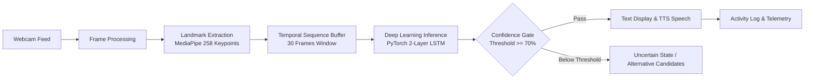

# SignBridge 🤟🌉

> **Real-Time Indian Sign Language (ISL) Assistive Communication System**  
> An accessible, privacy-preserving bridge connecting Deaf and Hard-of-Hearing individuals with the hearing world through computer vision, deep learning, and speech synthesis.

---

[](https://reactjs.org/)
[](https://vitejs.dev/)
[](https://tailwindcss.com/)
[](https://pytorch.org/)
[](https://developers.google.com/mediapipe)
[](https://python.org/)
[](LICENSE)

---

## 📖 Table of Contents

- [Overview](#-overview)
- [Key Features](#-key-features)
- [System Architecture](#-system-architecture)
- [Technology Stack](#-technology-stack)
- [Repository Structure](#-repository-structure)
- [Getting Started](#-getting-started)
  - [Prerequisites](#prerequisites)
  - [1. Frontend Setup (Web App)](#1-frontend-setup-web-app)
  - [2. Deep Learning Backend Setup (RTSLR)](#2-deep-learning-backend-setup-rtslr)
- [Core Vocabulary & Gestures](#-core-vocabulary--gestures)
- [Transparency & Ethical AI](#-transparency--ethical-ai)
- [License](#-license)

---

## 🌟 Overview

**SignBridge** is an assistive communication platform engineered to translate Indian Sign Language (ISL) gestures into audible speech and clear textual communication in real time. 

Natural sign languages are rich, multidimensional linguistic systems. SignBridge focuses on transparent, confidence-aware recognition—ensuring that high-probability gestures are communicated instantly while ambiguous gestures provide confidence metrics rather than false predictions.

### Why SignBridge?
- **Zero Privacy Intrusion**: Video frames are processed locally without unauthorized cloud streaming or permanent video storage.
- **Audible & Visual Feedback**: Integrated Text-to-Speech (TTS) immediately articulates translated signs for seamless in-person conversations.
- **Modular & Extensible**: A clean React architecture decoupled from the ML pipeline allows plug-and-play switching between client-side simulation engines and local PyTorch/ONNX inference backends.

---

## ✨ Key Features

- 🎥 **Real-Time Live Translation**:
  - Live webcam feed integration with positioning guides and aspect ratio handling.
  - Optical gesture tracking with confidence scoring and alternative prediction suggestions.
  - One-click pause, resume, and camera switching.
- 🔊 **Text-to-Speech (TTS) Voice Synthesis**:
  - Automatically speaks translated phrases using the Web Speech API.
  - Configurable speech rate, pitch, and volume.
- 📚 **Interactive Vocabulary Dictionary**:
  - Visual catalog of supported gestures with hand shape cues, motion guides, and typical confidence ratings.
  - Search and filter by category (Greetings, Daily Needs, Courtesy, Emergency, etc.).
- 📊 **Telemetry & Performance Dashboard**:
  - Live frame rate (FPS), latency tracking, and confidence distribution charts.
  - System health metrics and quick-start actions.
- 🕒 **Session History & Data Export**:
  - Comprehensive activity log recording every recognized gesture with timestamp and confidence level.
  - Export session logs to **JSON** or **CSV** for record-keeping or research.
- ⚙️ **Customizable Settings**:
  - Adjust confidence thresholds, auto-speak toggles, and UI preferences on the fly.

---

## 🏗️ System Architecture

The SignBridge assistive pipeline transforms optical frames into synthesized speech:



### Inference Pipeline Breakdown:
1. **Optical Capture**: Standardized 30 FPS video feed from user webcam.
2. **Keypoint Extraction**: 258 normalized landmarks per frame (33 pose landmarks + 21 landmarks per hand × 2 hands).
3. **Temporal Modeling**: Sliding 30-frame sequence passed to a 2-layer LSTM model with 128 hidden units.
4. **Confidence Verification**: Softmax output evaluated against configurable thresholds (default: 70%).
5. **Speech Synthesis**: High-confidence predictions trigger real-time TTS audio generation.

---

## 💻 Technology Stack

### Frontend Application
- **Framework**: React 18
- **Build Tool**: Vite 6
- **Styling**: Tailwind CSS, PostCSS, Autoprefixer
- **Icons**: Lucide React
- **Audio Synthesis**: Web Speech API (`SpeechSynthesis`)

### Machine Learning & Backend (RTSLR)
- **ML Framework**: PyTorch
- **Computer Vision**: Google MediaPipe, OpenCV (`cv2`)
- **Backend API**: Flask
- **Data Computation**: NumPy, Pillow

---

## 📁 Repository Structure

```text
SignBridge/
├── index.html                    # Single Page Application root
├── package.json                  # Frontend dependencies & npm scripts
├── vite.config.js                # Vite build configuration
├── tailwind.config.js            # Tailwind CSS design system tokens
├── postcss.config.js             # PostCSS plugin setup
├── .gitignore                    # Version control exclusion rules
│
├── src/                          # Frontend Source Code
│   ├── main.jsx                  # Application entry point
│   ├── App.jsx                   # Root layout, navigation & modal wrappers
│   ├── index.css                 # Base stylesheet & utility classes
│   ├── context/
│   │   └── AppContext.jsx        # Global state (camera, history, settings, toasts)
│   ├── services/
│   │   └── recognitionEngine.js  # Async gesture recognition service interface
│   ├── data/
│   │   └── vocabulary.js         # Supported ISL vocabulary & initial state
│   ├── components/
│   │   ├── Sidebar.jsx           # Desktop & responsive drawer navigation
│   │   ├── Topbar.jsx            # Header with status pills and actions
│   │   ├── SettingsModal.jsx     # Configuration modal (TTS, thresholds, engine)
│   │   └── Toast.jsx             # Global non-blocking notification alerts
│   └── pages/
│       ├── Dashboard.jsx         # Telemetry metrics, quick actions & activity feed
│       ├── LiveTranslation.jsx   # Live camera feed, landmark overlay & translation
│       ├── Vocabulary.jsx        # Interactive ISL sign dictionary & guides
│       ├── History.jsx           # Filterable translation logs & export tools
│       └── About.jsx             # Technical pipeline documentation & ethics
│
└── RTSLR-main/                   # Real-Time Sign Language Recognition Engine
    └── RTSLR-main/
        ├── app.py                # Flask application & MediaPipe inference server
        ├── sign_lstm_best.pt     # Trained PyTorch LSTM weights (49 ISL classes)
        ├── requirements.txt      # Python dependencies
        ├── templates/            # Standalone Flask web interfaces
        └── README.md             # Deep learning model documentation
```

---

## 🚀 Getting Started

### Prerequisites

- **Node.js**: v18.0.0 or later ([Download Node.js](https://nodejs.org/))
- **Python**: v3.8 or later (for running the PyTorch backend)
- **Webcam**: Functional camera for real-time video inference

---

### 1. Frontend Setup (Web App)

1. Clone the repository and navigate to the project root:
   ```bash
   git clone https://github.com/your-username/SignBridge.git
   cd SignBridge
   ```

2. Install Node dependencies:
   ```bash
   npm install
   ```

3. Start the local development server:
   ```bash
   npm run dev
   ```

4. Open your browser and navigate to:
   ```text
   http://localhost:5173
   ```

5. To build for production deployment:
   ```bash
   npm run build
   npm run preview
   ```

---

### 2. Deep Learning Backend Setup (RTSLR)

If you wish to run the standalone PyTorch + MediaPipe recognition server:

1. Navigate to the backend directory:
   ```bash
   cd RTSLR-main/RTSLR-main
   ```

2. Create and activate a Python virtual environment:
   ```bash
   # On Windows (PowerShell):
   python -m venv venv
   .\venv\Scripts\Activate.ps1

   # On macOS/Linux:
   python3 -m venv venv
   source venv/bin/activate
   ```

3. Install required Python packages:
   ```bash
   pip install -r requirements.txt
   ```

4. Launch the inference server:
   ```bash
   python app.py
   ```

5. Access the backend interface at `http://localhost:5000`.

---

## 🤟 Core Vocabulary & Gestures

The client-side interface includes a curated set of high-priority gestures designed for essential daily communication:

| Sign | Category | Description | Typical Confidence |
| :--- | :--- | :--- | :---: |
| **HELLO** | Greetings | Open right palm raised beside forehead moving outward in a friendly salute. | 94% |
| **GOOD MORNING** | Greetings | Compound gesture: flat hand moves from chin transitioning into sunrise motion. | 90% |
| **THANK YOU** | Courtesy | Flat fingertips touch chin/lips then smoothly extend forward toward viewer. | 91% |
| **YES** | Affirmations | Fist held at chest level gently nodding vertically mimicking a head nod. | 93% |
| **NO** | Affirmations | Index and middle fingers snap shut against extended thumb in negation. | 89% |
| **HELP** | Emergency | Upright closed fist placed atop supporting open palm, lifted together. | 87% |
| **WATER** | Daily Needs | W-handshape gently tapping twice against the chin or lower lip. | 92% |
| **FOOD** | Daily Needs | Clustered fingertips brought toward mouth repeatedly in an eating motion. | 88% |

> The underlying RTSLR PyTorch model supports an extended vocabulary of **49 distinct ISL gesture classes**, including alphanumeric signs, questions, and action words.

---

## 🛡️ Transparency & Ethical AI

- **Scope Delimitation**: SignBridge does not claim universal ISL translation. Natural sign languages encompass complex dialectal variations, spatial grammar, and facial expressions (non-manual markers). This system focuses on high-precision core communication.
- **Confidence Disclosure**: Every gesture prediction is coupled with transparent confidence indicators to prevent misinterpretation in critical situations.
- **Privacy First**: Video frames remain on the client device during web translation, respecting the privacy of individuals and their surrounding environments.

---

## 📄 License

This project is licensed under the [MIT License](LICENSE).
